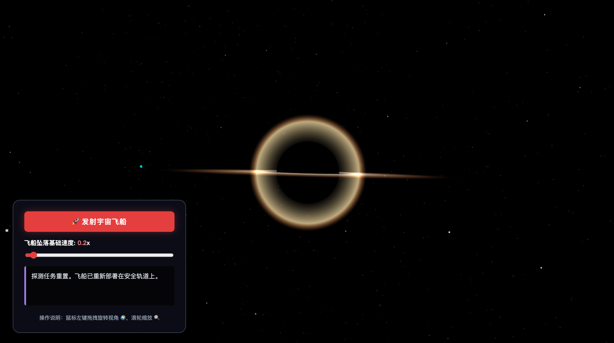

# 🌌 黑洞探测模拟器 - 相对论效应版

一个基于 Three.js 的交互式黑洞模拟项目，展示了黑洞的视觉效果及相对论效应。

## 🎮 功能特性

- **事件视界**：绝对黑体的黑洞核心
- **光子球**：光线弯曲形成的亮环（已修复光环边界遮挡问题）
- **吸积盘**：旋转的炽热气体盘
- **宇宙飞船**：可控制的探测飞船
- **时间膨胀**：接近黑洞时的时间变慢效果
- **面条化**：极端引力差造成的拉伸效果
- **星空背景**：3000颗星星组成的深空场景

## 🖼️ 效果图



## 🕹️ 操作说明

- **鼠标左键拖拽**：旋转视角
- **滚轮**：缩放视图
- **发射宇宙飞船按钮**：启动飞船向黑洞坠落
- **速度滑块**：调节飞船坠落速度（1.0x - 3.0x）

## 🚀 运行方式

直接在浏览器中打开 `black.html` 文件即可运行。

## 🛠️ 技术栈

- **Three.js** 0.160.0 - 3D渲染引擎
- **OrbitControls** - 视角控制
- **原生 HTML/CSS/JavaScript**

## 📝 项目结构

```
Black-Hole-Simulation/
├── black.html    # 主页面，包含所有代码
├── black.png     # 效果图截图
└── README.md     # 项目说明文档
```

## ⚡ 物理效果模拟

1. **事件视界**：黑洞表面，光无法逃脱
2. **光子球**：距离黑洞约1.5倍事件视界半径处，光线绕黑洞旋转
3. **吸积盘**：落入黑洞的物质被加热到极高温度，发出强烈辐射
4. **时间膨胀**：根据广义相对论，靠近黑洞的物体时间流逝变慢
5. **潮汐力**：黑洞附近的引力差导致物体被拉伸（面条化效应）
